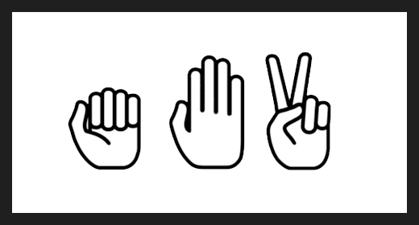
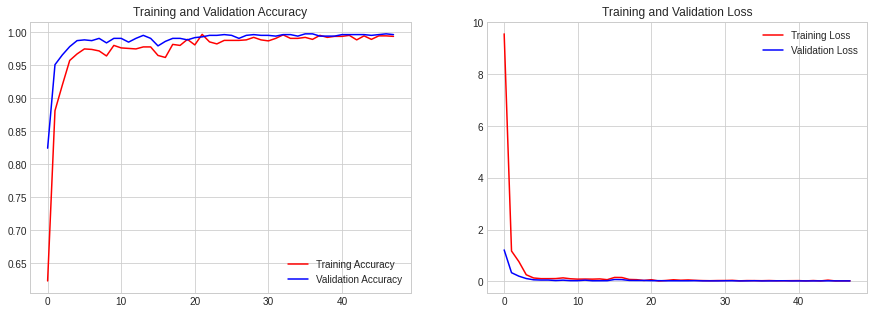

<h1 align="center">Rock ✊🏼 Paper ✋🏼 Scissors ✌🏼</h1>

<p align="center">
    
</p>

<p align="center">
    In this project, I explore how we can use CNN and transfer learning to build an image classifier. <br>The dataset consists of 2188 images that classified by <strong>Rock<strong>, <strong>Paper<strong>, and <strong>Scissors<strong>.
</p>

<p align="center">
   The full dataset can be downloaded <a href="https://dicodingacademy.blob.core.windows.net/picodiploma/ml_pemula_academy/rockpaperscissors.zip">here</a>
</p>

## File Structure

```
.
├── Images
├── Models
│   ├── model_inception_weights.h5
│   └── modeling.ipynb
├── Procfile
├── setup.sh
├── requirements.txt
├── apps.py
└── etc.
```

## File Description

There are only 3 important files in this repository.
- `modeling.ipynb` is a jupyter notebook which can be run on Google Colab (with GPU for faster training). It contains step-by-step on how to create the image classifier and export the model. 
- `model_inception_weights.h5` is the trained weights of our deep learning model's layers. This is used to load the model in our web app.
- `apps.py` is the python file to deploy our web app in Streamlit.


## How to Use

To run the project locally, you can download this repo and type 

```
streamlit run apps.py
```

To view the project as a deployed online web app hosted by Heroku, you can check out with [this link](https://rps-myarist.herokuapp.com/)


## Model Description

The foundational model that we use is Inception-V3 from Keras' pretrained models. However, we cut it off until 'mixed7' layer, and then add our own layers.

Read more about this model at:
- https://keras.io/api/applications/inceptionv3/
- https://arxiv.org/abs/1512.00567


## Model Evaluation

We achieved 99,55% accuracy on training set and 99,66% accuracy on validation set.

<details>
<summary>Confussion Matrix</summary>

<br>

```
[[284   0   1]
 [  1 290   0]
 [  0   0 300]]
```

</details>

<details>
<summary>Classification Report</summary>

<br>

```
              precision    recall  f1-score   support

        Rock       1.00      1.00      1.00       285
       Paper       1.00      1.00      1.00       291
    Scissors       1.00      1.00      1.00       300

    accuracy                           1.00       876
   macro avg       1.00      1.00      1.00       876
weighted avg       1.00      1.00      1.00       876
```

</details>

<details>
<summary>Training and Validation Accuracy and Loss</summary>

<br>



</details>
